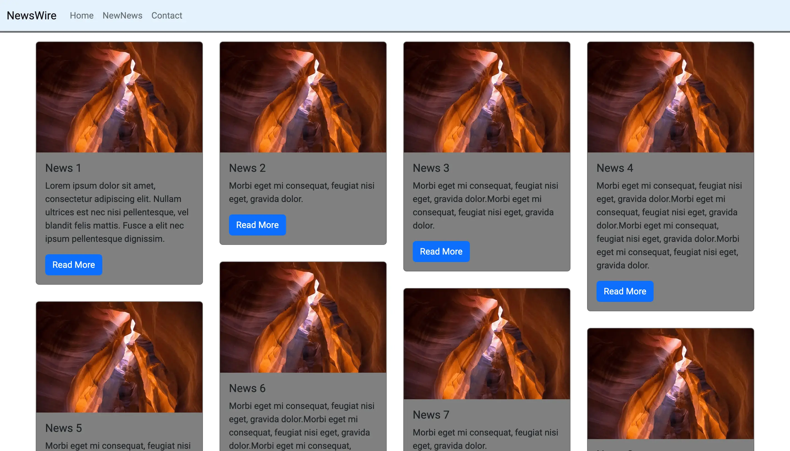

# NewsWire-Server

NewsWire is a web application that allows users to create, read, update, and delete news articles. The application is built using the Model-View-Controller (MVC) architecture, and uses React for the frontend and Node.js for the backend.

<hr>

💙 Join the channel to see more videos like this. [Code_With_Pankaj](https://www.youtube.com/c/CodeWithPankaj1?sub_confirmation=1)
<hr>

<div align=center>

## Must visit 👇 (Click on it)

[](https://www.youtube.com/c/CodeWithPankaj1?sub_confirmation=1)

</div>

<hr>

# Features

## Newswire provides the following features:

- Create news articles: Users can create new news articles by filling out a form that includes fields for the article's title, content, author, and category.
- Read news articles: Users can view a list of all the news articles that have been created, as well as view the details of individual articles.
- Update news articles: Users can edit the title, content, author, and category of existing news articles.
- Delete news articles: Users can delete news articles they no longer want to keep in the system.

# Authors

- [@PankajBaliyan](https://www.github.com/pankajbaliyan)


# Contributing

This project is open for contributions. If you would like to contribute to this project, you can fork the repository and submit a pull request.<br>
Contributions are always welcome!

See `index.html` for ways to get started.

Please adhere to this project's `code of conduct`.


# Demo

Client : https://newswire-client.onrender.com
<br><br>
Server : https://newswire-server.onrender.com

# Feedback

If you have any feedback, please reach out to us at pankajbaliyan90@gmail.com


# 🔗 Links

[](https://codewithpankaj.vercel.app)

<a href="https://www.youtube.com/c/codewithpankaj1?sub_confirmation=1" target="blank"></a>
<a href="https://linkedin.com/in/pankaj-kumar-90" target="blank"></a><br><br>
<a href="https://leetcode.com/pankajkumar90/" target="blank"></a>
<a href="https://auth.geeksforgeeks.org/user/im_pankaj/practice/" target="blank"></a><br><br>
<a href="https://twitter.com/_pankaj_kumar__" target="blank"></a>
<a href="https://www.hackerrank.com/pankajbaliyan90" target="blank"></a>
<a href="https://discord.gg/qYz4cYc9zP" target="blank"></a>


# Lessons Learned

- MVC architecture can help to organize the codebase: By separating the application logic into models, views, and controllers, it becomes easier to maintain and extend the codebase. It also promotes the separation of concerns and makes the code easier to test.

- React can be a powerful tool for building user interfaces: React's component-based approach allows for reusable and modular code, which can save time and effort in the long run. React's virtual DOM also helps to optimize the rendering performance of the application.
# Run Locally

Clone the project

```bash
  git clone https://github.com/PankajBaliyan/NewsWire-Server.git
```

Go to the project directory

```bash
  cd NewsWire-Server
```

Start code editor

```bash
  code .
  npm install
  nodemon start
```


# Screenshots




# Support

For support, email pankajbaliyan90@gmail.com or join our Slack channel.